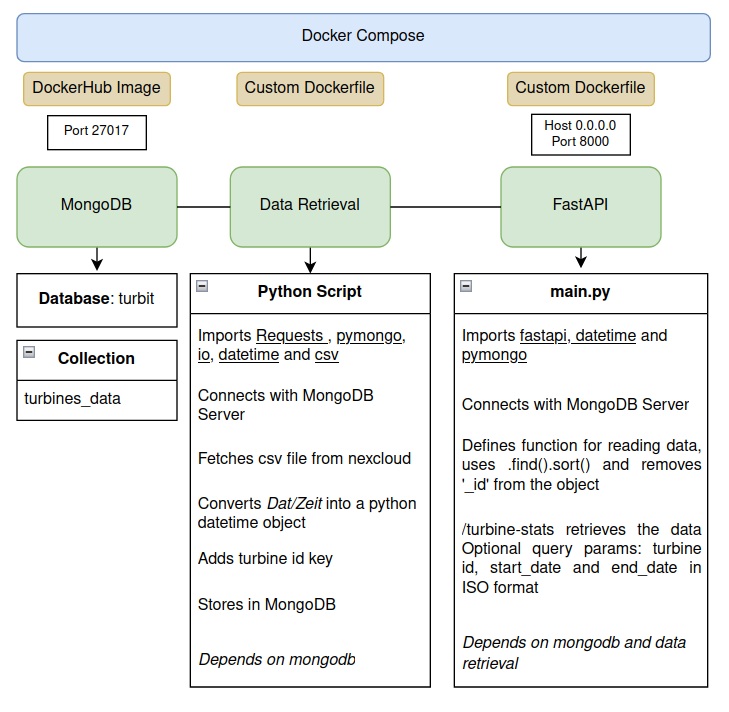

# Task 2
## Time Series Data Handling and API Development 

[Installation instructions](docs/install.md)  
[Technical Documentation](docs/documentation.md)  

### Overview
Load time series data from CSV files into a MongoDB collection and make the data accessible through the FastAPI. 

